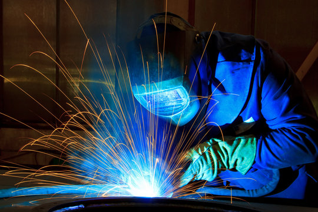
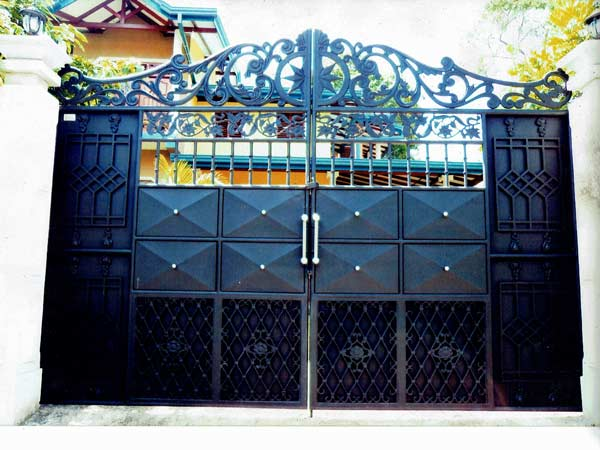
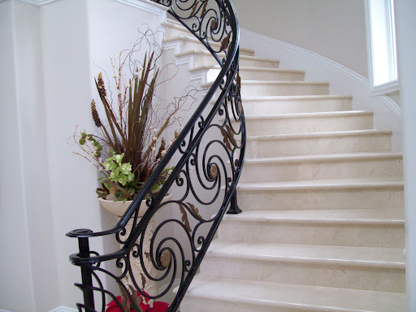
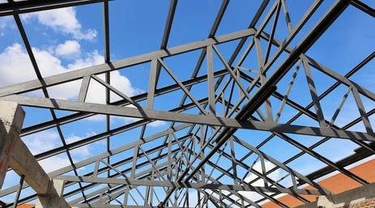
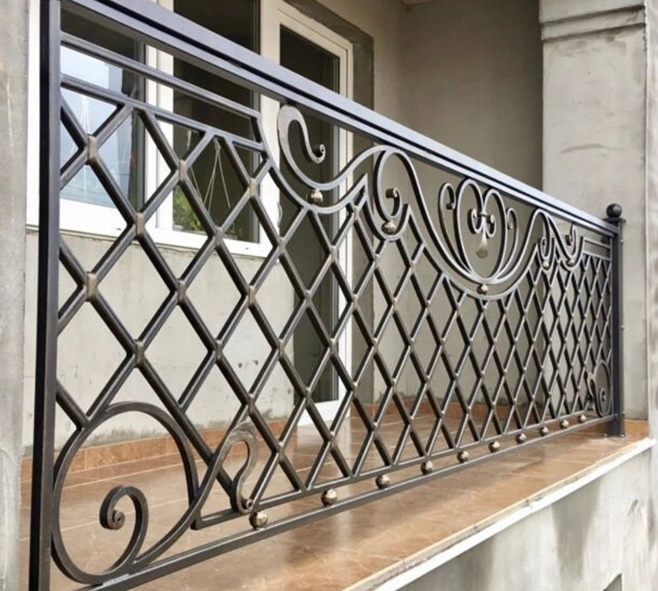
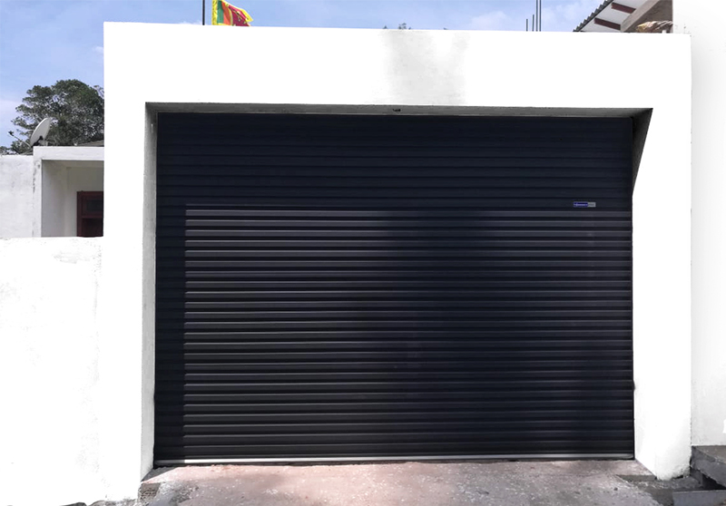

<!DOCTYPE html>
<html lang="en">
<head>
    <meta charset="UTF-8">
    <meta name="viewport" content="width=device-width, initial-scale=1.0">
    <title>Iron Works</title>
    
</head>
<body>
    <header>
        <nav>
            
PRASANNA IRON WORKS

            <ul>
                <li><a href="#home">Home</a></li>
                <li><a href="#about">About Us</a></li>
                <li><a href="#services">Services</a></li>
                <li><a href="#works">Our Works</a></li>
                <li><a href="#contact">Contact</a></li>
            </ul>
            

                <a href="tel:+94703618426" class="btn">Contact Us</a>
            

        </nav>
    </header>

    

        
        

            <h1>IRON WORKS</h1>
            
We specialize in metal fabrication, creating beautiful and durable ironwork for residential and commercial clients. Our services include gates, iron doors, iron windows, Construction of roofs of houses, including decorative elements. With a commitment to quality craftsmanship, we bring your vision to life.

            

            <a href="tel:+94703618426" class="btn">Call Now</a>
        

    

    <section id="works" class="section">
        <h2>Our Works</h2>
        
Iron gates, iron stairs, iron roofs and windows, etc...
          .

        

            

                
                
Custom Gate

            

            

                
                
Wrought Iron Staircase

            

            

                
                
Steel Structure

            

            

                
                
Decorative Fencing

            

            

                
                
Balcony Railing

            

            

                
                
Modern Gate

            

        

    </section>

    

        <h3>Need custom ironwork?</h3>
        
Contact us today for a free consultation and let's bring your vision to life with our expert craftsmanship.

        <a href="#contact" class="btn">Get a Quote</a>
    

    <footer>
        

            <h4>IronWorks</h4>
            
Dedicated to crafting high-quality iron solutions for over 20 years.

            

                <a href="#"><i class="fab fa-facebook-f"></i></a>
                <a href="#"><i class="fab fa-twitter"></i></a>
                <a href="#"><i class="fab fa-instagram"></i></a>
                <a href="#"><i class="fab fa-linkedin-in"></i></a>
            

        

        

            <h4>Operating Hours</h4>
            <ul>
                <li>Mon - Fri: 8am - 5pm</li>
                <li>Saturday: 8am - 5pm</li>
                <li>Sunday: 8am - 5pm</li>
            </ul>
        

        

            <h4>Contact</h4>
            <ul>
                <li>Woodland watta,Gonupinuwala.</li>
                <li>prasanna@gmail.com</li>
                <li>0703618426</li>
            </ul>
        

        

            <h4>Privacy Policy</h4>
            <ul>
                <li><a href="#">Terms & Conditions</a></li>
                <li><a href="#">Sitemap</a></li>
            </ul>
        

    </footer>

    
</body>
</html>
